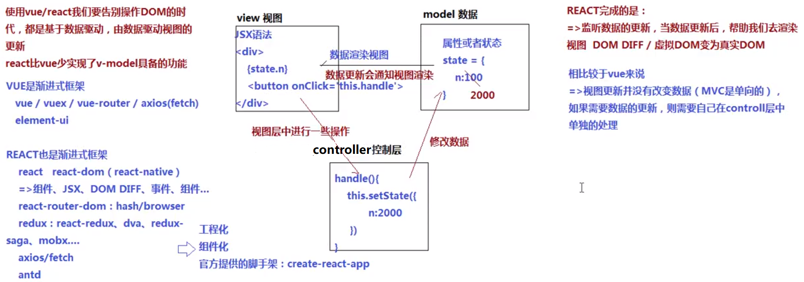

### vue 是MVVM框架（model view viewModel）
>需要我们处理的是
- model：data（defineProperty Getter/Setter）、computed、vuex...
- view：template、el、render...
- viewModel：vue本身实现，用来监听数据和视图的改变，从而实现双向数据绑定

### react是MVC框架（model view controller）
 

### react脚手架：create-react-app
- https://create-react-app.dev/docs/getting-started/
- 全局环境安装脚手架
> $ npm install -g create-react-app
- 基于脚手架快速构建工程化项目
> create-react-app xxx （如果电脑上安装了yarn， 默认基于yarn安装）

----
- 不想安装在全局，可以基于npx一步到位
> npx create-react-app xxx

### 脚手架创建的项目目录
|- node_modules 所有安装的模块
|- public
    |- index.html SPA单页面应用中，各组件最后合并渲染完成后的结果都会放入到页面的#root盒子中呈现
    |- xxx.html MPA/SPA这里存放的是最后编译页面的模板
    |- 我们还可能会在此放一些公共资源，把这些资源直接基于src/link的方式调入到页面模板中，而不是基于webpack最后合并在一起（不建议这样，但是项目中，可能存在一些模块不支持CommonJS/ES6Module规范，此时我们只能在这里直接引入使用了）
|- src 整个项目的大部分源码都写在这个目录下
    |- index.js 项目入口，webpack从这个文件开始导入打包（MPA中需要创建多入口文件）
    |- api 数据处理
    |- store redux公共状态管理的
    |- assets 存储公共资源的（图片和样式）
    |- utils 公共的JS模块
    |- routes 路由管理的
    |- components 公共的组件
    |- ...
|- package.json

### 默认的配置清单
- 生产依赖项（dependencies）
    + react REACT框架的核心，提供了状态、属性、组件、生命周期等
    + react-dom 把JSX语法渲染成为真实的DOM，最后显示在浏览器中
    + react-scripts 包含了当前工程化项目中webpack配置的东西（嫌弃把webpack放到项目目录中看上去太丑，react脚手架把所有webpack的配置项和依赖都隐藏在node_modules中了，react-scripts这个REACT脚本执行命令，会通知webpack打包编译）
- scripts 当前项目可执行的脚本命令($ yarn xxx)
    + $ yarn start => 开发环境下启动项目（默认会基于WEBPACK-DEV-SERVER创建一个服务，用来随时编译和渲染开发的内容）
    + $ yarn build => 生产环境下，把编写内容打包编译，放到build文件目录下（服务器部署）
    + $ yarn eject => 把所有隐藏在node_modules中的webpack配置项都暴露出来（方便自己根据项目需求，二次更改webpack配置）

